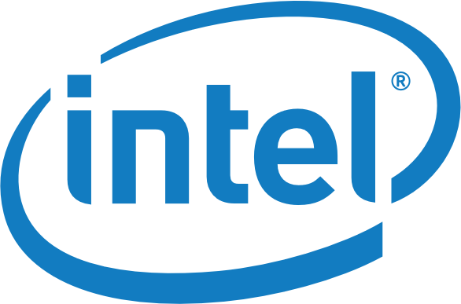

# Community

## GitHub developers
---
[Contributors](https://github.com/GoogleCloudPlatform/PerfKitBenchmarker/graphs/contributors)

## Academia
---

## Industry Partners
---

## Cloud Technology Partners
---

