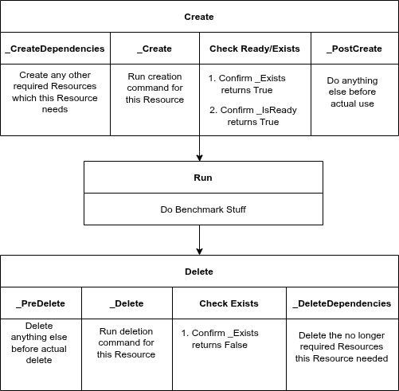

# PKB Resource Structure

## What is a PKB resource?

All resources inherit from
[resource.BaseResource](https://github.com/GoogleCloudPlatform/PerfKitBenchmarker/blob/master/perfkitbenchmarker/resource.py)
& represent various real Cloud resources in python. A typical resource is
configured by a spec inheriting from
[BaseSpec](https://github.com/GoogleCloudPlatform/PerfKitBenchmarker/blob/master/perfkitbenchmarker/configs/spec.py),
encoded in the `BENCHMARK_CONFIG` of each benchmark via
[benchmark_config_spec.py](https://github.com/GoogleCloudPlatform/PerfKitBenchmarker/blob/master/perfkitbenchmarker/configs/benchmark_config_spec.py),
& the python object instantiated by
[benchmark_spec.py](https://github.com/GoogleCloudPlatform/PerfKitBenchmarker/blob/master/perfkitbenchmarker/benchmark_spec.py).
Said python resource has `_Create` & `_Delete` commands which will run the
corresponding CLI commands to create the actual Cloud resource. For example,
[GoogleCloudRunJob](https://github.com/GoogleCloudPlatform/PerfKitBenchmarker/blob/master/perfkitbenchmarker/providers/gcp/google_cloud_run_jobs.py)
represents a Cloud Run Job running on GCP & can create & delete such a job.

## Adding a new resource

The
[PR](https://github.com/GoogleCloudPlatform/PerfKitBenchmarker/commit/4daab75b21848ce46e5bf60760e363d98a147f6f)
to add
[example_resource.py](https://github.com/GoogleCloudPlatform/PerfKitBenchmarker/blob/master/perfkitbenchmarker/resources/example_resource.py)
is a great example of adding a new resource, spec, & plumbing it into
`benchmark_spec.py` & `benchmark_config_spec.py`.

## Resource Lifecycle

Resources have quite a few components to the `_Create` & `_Delete` functions.
Some of these are somewhat self explanatory but let’s go into detail. Why so
many different pieces? Why would you want to put something into one function vs
another?

*   There is a timer started right before `_Create` & ended right after
    `_Exists` / `_IsReady` are confirmed. These are turned into “Time to
    Create”, “Time to Ready”, & “Time to Delete” samples automatically for each
    resource. As such, what you put in `_Create` should be the operations that
    you want to time. If there are things you need to setup before/after but
    don’t want to time, you can put those into the `_CreateDependencies` or
    `_PostCreate` functions.

What’s the difference between `_Exists` vs `_IsReady`?

*   `_Exists` is often a cloud reported statement like “does the resource appear
    with a list or describe command?” This should return False before it’s
    created, True after it’s created, & False after it’s been deleted.
*   `_IsReady` indicates the resource is usable, rather than still in a
    “creating” or busy state.

## Supporting Multi-Cloud

A core feature of PKB is the ability to run similar resources on multiple
clouds. This happens via having a shared parent class with per-cloud
implementations. The parent class often lives in the root or
[resources/](https://github.com/GoogleCloudPlatform/PerfKitBenchmarker/tree/master/perfkitbenchmarker/resources)
folder while the per-cloud classes always live in the
[providers/](https://github.com/GoogleCloudPlatform/PerfKitBenchmarker/tree/master/perfkitbenchmarker/providers)
folder.

### Code Example

[Kubernetes Cluster](https://github.com/GoogleCloudPlatform/PerfKitBenchmarker/blob/master/perfkitbenchmarker/resources/container_service/kubernetes_cluster.py)
represents a generic Kubernetes cluster which both
[EKS](https://github.com/GoogleCloudPlatform/PerfKitBenchmarker/blob/master/perfkitbenchmarker/providers/aws/elastic_kubernetes_service.py)
&
[GKE](https://github.com/GoogleCloudPlatform/PerfKitBenchmarker/blob/master/perfkitbenchmarker/providers/gcp/google_kubernetes_engine.py)
implement for AWS & GCP respectively. The PKB user can run via EKS or GKE by
controlling via `--cloud=AWS` or `--cloud=GCP` respectively. Under the hood,
`benchmark_spec` selects for the correct implementation using the
`container_cluster.GetContainerClusterClass` function (which in turn works via
registration + reflection if you must know).

### Takeaway for Writing Code

This inheritance pattern is the key way PKB works on multiple clouds. All code
NOT in a cloud specific resource should be cloud agnostic. If you want to add
cloud specific code, a common pattern would be to add a new generic function in
the `BaseCloudParent` class & then implement it with specifics in the
`CloudSpecificChild` class.

## Flags & Spec

Configurations can be controlled by both spec values & flag values, and
frequently both. Flag values are a convenient way to set values, as you can eg
just set `--zone=us-central1-a` rather than
`cluster_boot.container_cluster.vm_spec.GCP.zone=us-central1-a`. In the
`_spec.py` file, that zone value will be overridden by said above convenience
flag.

The main purpose of flags in PKB is to control different testing configurations.
ie test “does scenario A with flags foo=bar perform better than scenario B with
foo=fiz?” Most runs will override a bunch of values.

### Flag Guidelines

Here are some guidelines to keep in mind when developing flags:

*   Choose a reasonable default config, but don’t worry too much about the
    specific values.
*   Feel free to hardcode some values or settings, especially those which are
    unlikely to change. ie not everything needs a flag or a spec value.
*   Do NOT necessarily map PKB flags 1:1 with underlying resource flags,
    especially if values always go together. For example, if a feature you want
    to use is only available in the alpha or beta version of a product, only add
    the one feature flag & have an if statement on that feature flag add both
    the actual feature flag & the alpha/beta argument.
*   Prefer utilizing benchmark config, spec, & resource flags to customizing
    resources in the benchmark or using benchmark specific flags.
*   DO add benchmark level flags for values which are only used in that
    benchmark & don’t make sense in the resource. Clear examples are eg “amount
    of QPS the client VM sends”, “number of times to repeat an operation”.

## Metadata

The flipside of many flags/spec is metadata. Metadata is reported in
[Samples](https://github.com/GoogleCloudPlatform/PerfKitBenchmarker/blob/master/perfkitbenchmarker/sample.py)
exported by PKB and displays the values for various settings. While manually
self-recording results, you might save the command you used to run a benchmark,
but metadata lets you store only the resulting data & partially infer how it was
run. This distinguishes results from 2 different runs from each other
(especially in downstream services). Metadata can be either a 1:1 copy from the
specs/flags set, or it can be information collected from live from the resource.
The latter is preferred, especially if you don't specify a value & get some
default. For an example,
[KubernetesCluster](https://github.com/GoogleCloudPlatform/PerfKitBenchmarker/blob/c3944d812c44389668a1f4ff23d600832211f56d/perfkitbenchmarker/resources/container_service/kubernetes_cluster.py#L88)’s
GetResourceMetadata pulls the version (which is often not set) as a live
command, while its parent
[BaseContainerCluster](https://github.com/GoogleCloudPlatform/PerfKitBenchmarker/blob/c3944d812c44389668a1f4ff23d600832211f56d/perfkitbenchmarker/resources/container_service/container_cluster.py#L210)
copies the spec values used to create it.
