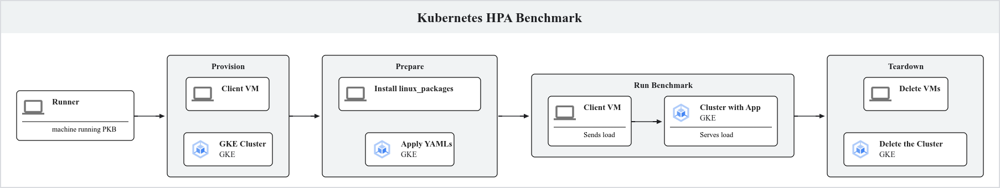

# How to add a GKE Benchmark

This GKE walkthrough will show how to run the example kubernetes_hpa benchmark,
how it works, and how to add a new GKE benchmark. This is aimed for folks who've
run PKB at least once but would like to dive into the GKE space, and can provide
useful references for more experiened users as well. If you haven't run PKB at
all yet, try out the
[beginner walkthrough](https://github.com/GoogleCloudPlatform/PerfKitBenchmarker/tree/master/tutorials/beginner_walkthrough)
first.

## Demo: Run an existing GKE benchmark

Run the GKE HPA autoscaling benchmark (will take ~30 min):

```
PROJECT_ID=gke-dev-project  # Fill in your project id here. You must be
                         # able to create GKE clusters within this
                         # project.

./pkb.py -- \
    --benchmarks kubernetes_hpa \
    --cloud GCP \
    --project="${PROJECT_ID}" \
    --config_override=kubernetes_hpa.container_cluster.max_vm_count=3 \
    --locust_path=locust/simple.py

# Review the results.
cat /tmp/perfkitbenchmarker/runs/uuid/perfkitbenchmarker_results.json | grep locust_overall
```

## Benchmark Architecture



### Phases

A PKB benchmark goes through several phases - provision, prepare, run, &
teardown, as visualized above. - "Provision" creates the resources defined in
the benchmark config spec below. - “Prepare” installs any dependencies, such as
a load testing tool or a yaml manifest. - “Run” actually runs the benchmark and
generates results. - "Teardown" deletes all of the provisioned resources to
cleanup the project & rein in costs. If the benchmark fails or the resource is
not setup properly, you could leave resources running & costing money, so check
the project afterwards to confirm PKB resources (which usually have names like
pkb-1234) are all deleted.

The example kubernetes_hpa benchmark creates/deletes both a GKE cluster & a GCE
VM. The GKE cluster runs a webapp serving traffic while the GCE VM sends load to
that cluster.

### Provisioning Resources

#### PKB Benchmark Config & YAML

Here’s the benchmark config from
[kubernetes_hpa_benchmark.py](https://github.com/GoogleCloudPlatform/PerfKitBenchmarker/blob/master/perfkitbenchmarker/linux_benchmarks/kubernetes_hpa_benchmark.py),
with added comments.

The inner workings & definitions of each key can be found by looking at specs &
their decoder definitions. The root is
[BenchmarkConfigSpec](https://github.com/GoogleCloudPlatform/PerfKitBenchmarker/blob/master/perfkitbenchmarker/configs/benchmark_config_spec.py)
and its decoder method has vm_groups, container_specs, container_cluster, etc..
[NodepoolSpec](https://github.com/GoogleCloudPlatform/PerfKitBenchmarker/blob/master/perfkitbenchmarker/configs/container_spec.py)
defines vm_count / vm_spec as seen below under container_cluster.

```
kubernetes_hpa:
  description: Benchmarks how quickly hpa reacts to load
  # The GCE VM(s) to spin up. For this benchmark, used as a client VM separate from the GKE server.
  vm_groups:
    default:
      vm_spec: *default_dual_core
      vm_count: 1
  # Defines the images to build. These can be found in perfkitbenchmarker/data/docker/$container_name
  container_specs:
    kubernetes_fib:
      image: fibonacci
  # An empty container_registry must be specified to allow above images to be built../data/docker/$container_name
  container_registry: {}
  # Defines the actual Kubernetes cluster. Nodepools & their machine types can be specified. vm_count & vm_spec in the root container_cluster defines those values for the default nodepool.
  container_cluster:
    cloud: GCP
    type: Kubernetes
    vm_count: 1
    vm_spec: *default_dual_core
    nodepools:
      fibpool:
        vm_count: 3
        vm_spec:
          GCP:
            machine_type: n2-standard-4
          AWS:
            machine_type: m6i.xlarge
  # Flags can be defined in the BENCHMARK_CONFIG or simply passed in at runtime. Flags passed in at runtime always override the BENCHMARK_CONFIG.
  flags:
    locust_path: locust/rampup.py
```

Another config example & some more detail (like how to override with flags) can
be found
[here](https://github.com/GoogleCloudPlatform/PerfKitBenchmarker?tab=readme-ov-file#configurations-and-configuration-overrides).

### Resource Code

To actually spin up clusters and VMs, PKB maintains a python representation of
Cloud resources which runs gcloud/kubectl commands & parses the output to create
and delete resources. For GKE,
[container_service.py](https://github.com/GoogleCloudPlatform/PerfKitBenchmarker/blob/master//perfkitbenchmarker/container_service.py)
contains the base classes for a Kubernetes cluster & a container registry. The
specific GCP implementation is found in
[google_kubernetes_engine.py](https://github.com/GoogleCloudPlatform/PerfKitBenchmarker/blob/master/perfkitbenchmarker/providers/gcp/google_kubernetes_engine.py).

A resource has several important functions:

1.  `def Create()` - Creates the resource by assembling & executing a CLI
    command.
2.  `def Delete()` - Deletes the resource with a command.
3.  `def GetResourceMetadata()` - Returns a dictionary of details about the
    resource, which get added to the samples eventually returned in the run
    phase. For example, the kubernetes version.

Also in container_service.py is
[KubernetesClusterCommands](https://github.com/GoogleCloudPlatform/PerfKitBenchmarker/blob/master/perfkitbenchmarker/container_service.py),
kind of a grab-bag of kubectl commands.

## Creating a benchmark

Steps:

1.  Create a new file in linux_benchmarks, named after your benchmark
    (e.g.[kubernetes_hpa_benchmark](https://github.com/GoogleCloudPlatform/PerfKitBenchmarker/blob/master/perfkitbenchmarker/linux_benchmarks/kubernetes_hpa_benchmark.py))
1.  Create a BENCHMARK_CONFIG variable that defines the cluster & what resources
    PKB will provision. <!-- disableFinding(LINK_ID) -->
    -   See above for more detail on the
        [benchmark config](#pkb-benchmark-config-yaml).
1.  Create three functions and implement them:

    ```
    def GetConfig(user_config):
    # Just hardcoded boilerplate
    return configs.LoadConfig(BENCHMARK_CONFIG, user_config, BENCHMARK_NAME)

    def Prepare(benchmark_spec):
      vm = benchmark_spec.vms[0]
      stdout, stderr = vm.RemoteCommand('cat SLOB/cr_tab_and_load.out')
      vm.PushFile(path, REMOTE_SCRIPT)
      vm.RemoteCommand(f'sudo chmod 755 {REMOTE_SCRIPT}')
      # See Prepare section below for more information.

    def Run(benchmark_spec) -> list[sample.Sample]:
      # Run the benchmark, returning a list of p3rf samples.
      # Run your load test tool to generate raw output eg. locust
      # You should be able to add all the commands that you compile in a notebook
      stdout, _, _ = container_service.RunKubectlCommand([ 'get', '-n', 'fib', 'svc/fib', '-o', "jsonpath='{.status.loadBalancer.ingress[0].ip}'", ])
      # Parse the output to extract the observed performance
      # Create list of samples return samples
    ```

## Finishing Up - Results & Testing

At this point you should be able to run your benchmark with something like:

```
./pkb.py -- \
    --benchmarks your_benchmark_name \
    --cloud GCP \
    --project="${PROJECT_ID}" \
```

& start resolving any errors that inevitably arise. Unit tests go in
[perfkitbenchmarker/tests](https://github.com/GoogleCloudPlatform/PerfKitBenchmarker/blob/master/perfkitbenchmarker/tests/)
& are recommended for any sufficiently complex code.

You should also inspect your results (found in `results.json` & printed at the
end of a benchmark run) & can compile a manual report at this point.

Automating run & graphing results is outside the scope of PKB.

## Prepare - Load Testing & Benchmarking Tools

The measurable part of a benchmark is often some operation - whether
provisioning startup times, sending load to a server, or running an open source
benchmark like
[NCCL](https://github.com/GoogleCloudPlatform/PerfKitBenchmarker/blob/master/perfkitbenchmarker/linux_packages/nccl.py)
for GPUs or
[SPEC](https://github.com/GoogleCloudPlatform/PerfKitBenchmarker/blob/master/perfkitbenchmarker/linux_packages/speccpu2017.py)
for CPU.

Installing these tools is done in the Prepare phase of the benchmark. Often
these means a manifest file is applied with container specifications, like in
[kubernetes_nginx_benchmark](https://github.com/GoogleCloudPlatform/PerfKitBenchmarker/blob/master/perfkitbenchmarker/linux_benchmarks/kubernetes_nginx_benchmark.py).
The actual
[manifest file](https://github.com/GoogleCloudPlatform/PerfKitBenchmarker/blob/master/perfkitbenchmarker/data/container/kubernetes_nginx/kubernetes_nginx.yaml.j2)
starts as a jinja file which has various variables rendered into it before
applying. Instead of applying a yaml, some GKE benchmarks attempt to reuse GCE
benchmarks by running setup commands (like git clone, pip install, etc) using
kubectl exec to run these commands in a pod instead of while ssh'ed into a VM.

The example kubernetes_hpa benchmark does both - it installs the locust tool via
[linux_packages/locust.py](https://github.com/GoogleCloudPlatform/PerfKitBenchmarker/blob/master/perfkitbenchmarker/linux_packages/locust.py)
to a GCE VM & then runs that against the Kubernetes cluster which has a web
server installed on it by applying
[this yaml](google3/third_party/py/perfkitbenchmarker/data/container/kubernetes_hpa/fib.yaml.j2).

Some other load test & benchmark tools PKB supports which may be interesting:

*   [Netperf](https://github.com/GoogleCloudPlatform/PerfKitBenchmarker/blob/master/perfkitbenchmarker/linux_packages/netperf.py)
    for raw network performance
*   [Memtier](https://github.com/GoogleCloudPlatform/PerfKitBenchmarker/blob/master/perfkitbenchmarker/linux_packages/memtier.py)
    for testing Redis

## Appendix

### Modifying variables & per-run configs

PKB supports flags. When running PKB, specify flags with simply
`--flag_key=flag_value`. To modify a value in the BENCHMARK_CONFIG for only one
run, eg change vm_count for kubernetes_hpa, pass a flag like
`--config_override=kubernetes_hpa.container_cluster.nodepools.fibpool.vm_count=10`.
Feel free to add flags, especially for variables specific to a benchmark, as
needed. Many that you might want - like machine type, max node count, &
kubernetes version - already exist & are defined as part of the GKE spec.

### Example PR

See https://github.com/GoogleCloudPlatform/PerfKitBenchmarker/pull/5451 for the
example pull request adding kubernetes_hpa, integrating a new benchmarking tool
(locust) and a benchmark that uses it.
